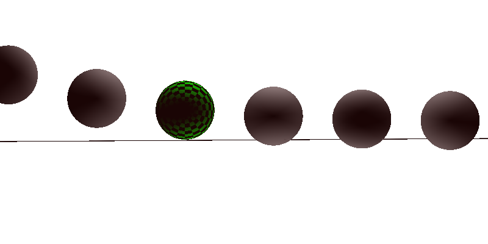
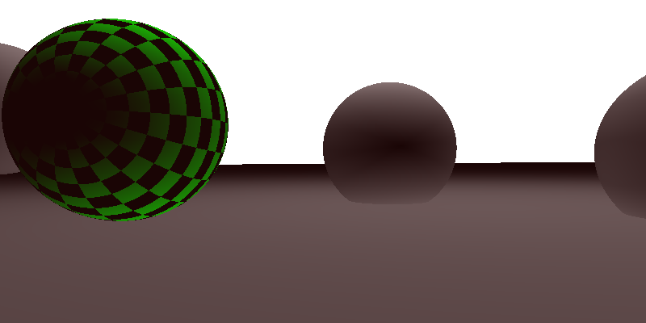

Basic Raytracing Effects
========================

The goal of this assignment is to implement basic ray tracing effects such as shadows, reflection, refraction and depth of field.

### Using Eigen

In all exercises, you will need to do operations with vectors and matrices. To simplify the code, you will use [Eigen](http://eigen.tuxfamily.org/).
Have a look at the [Getting Started](http://eigen.tuxfamily.org/dox/GettingStarted.html) page of Eigen as well as the [Quick Reference](http://eigen.tuxfamily.org/dox/group__QuickRefPage.html}) page for a reference of the basic matrix operations supported.

### Preparing the Environment

Follow instructions the general rules to setup what you need for the assignment.

### Submission

Please refer to general rules for more details on what to hand in.

Ex 0: Implement the intersection code [5pt]
------------------------------------------

Fill the functions `ray_sphere_intersection` and `ray_parallelogram_intersection` with the correct intersection between the ray and the primitives.

Output with sphere intersection


Output with sphere and plane intersection


Ex 1: Field of View and Perspective Camera [5pt]
------------------------------------------


The field of view of a perspective camera represents the angle formed between the camera's center and the sensor (aka the pixel grid through which rays are shot). The focal length is the distance between the camera center and the sensor and is called `f` in the figure above.

1. Fill the starter code to compute the correct value of `h` (`image_y` in the code). You can use the [Law of Sines](https://en.wikipedia.org/wiki/Law_of_sines).
2. Implement the perspective camera similarly to Assignment 1.


Output with correct `image_x` and `image_y`


Output with correct `image_x` and `image_y` and perspective camera (remember to change `is_perspective` to `true`)



Ex.2: Shadow Rays [10pt]
-----------------

To determine if a point is in the shadow of another or not, you must cast a ray from this point to the different light sources in the scene. If another object lies in between the point and the light source, then this light does not contribute to the point's color.

### Tasks

1. Implement the Phong shading (diffuse and specular color)
2. Fill in the starter code to implement shadow rays by implementing the function `is_light_visible`.

Output with correct shading


Output with shadows


Ex.3: Reflection [10pt]
-----------------------


To render mirrors, shading must also consider objects that could be reflected by the camera (primary) rays. This can be achieved by shooting new rays from the hit position to the scene with a new direction.

The direction of the reflected has been given in class and can be expressed as `r = 2n(n·v)-v`.

### Tasks

1. Fill the starter code to implement reflected rays. Don't forget to decrease the counter to limit the maximum number of 'bounce' a ray can make.

Output with reflections


Ex.3: Perlin Noise [10pt]
-------------------------

Implement the Perlin noise as explained in class.

### Tasks

1. Implement the linear interpolation
2. Implement the `dotGridGradient` function
3. Get the correct grid coordinates from the point `x` and `y`
4. Replace the linear interpolation with a cubic interpolation `(a1 - a0) * (3.0 - w * 2.0) * w * w + a0` and compare the results.


Output with linear interpolation


Output with cubic interpolation


Starting Code
-------------

After compiling the code following the process described in the general instructions, you can launch the program from command-line as follows:

```
mkdir build; cd build; cmake ..; make
./assignment3
```
Once you complete the assignment, you should see the result as a picture generated in your folder.


After implementing the perspective camera, specular highlights, shadows, reflections, and Perlin noise, the result of your code should be like this:


Bonus.1: Depth of Field [10pt]
------------------------------


A basic depth of field effect can be achieved in our simplified camera model. Instead of only one ray per pixel, one can shoot several rays per pixel as illustrated by the figure above. In practice, this means the hole of our camera no longer has an infinitesimal size, a parameter known as the aperture in real-world cameras.

Here, the focal plane of our camera corresponds to our pixel grid (which we have put at a distance `f` from the camera center). This means that object A, which is close to the focal plane, will appear sharper than object B, which is more distant.

To implement a depth of field effect, you will need to average the contribution of several rays per pixel, sampled randomly as suggested in the picture.

### Tasks

1. Fill in the starter code to implement depth of field.
2. Modify the input scene to move the rightmost sphere more into focus. Experiment with different settings of this effect.


Bonus.2: Refractions [15pt]
------------------------------
To render translucent objects, shading must also consider objects that could be seen through the surface hit by the camera (primary) rays. This can be achieved by shooting new rays from the hit position to the scene with a new refracted direction.


(Figure: [Wojciech Jarosz](https://canvas.dartmouth.edu/courses/16840))

The direction of the refracted ray can be derived from the Snell-Descartes law indicated on the figure.

### Tasks

1. Derive the formula for the direction of the refracted ray based on the Snell-Descartes law.
2. Implement the refraction color while being sure to check for total internal reflection (there may be no refracted ray if the incident direction is too low).

_All credits go to Dr.Teseo Schneider https://github.com/teseoch/CG-Spring-2023_
